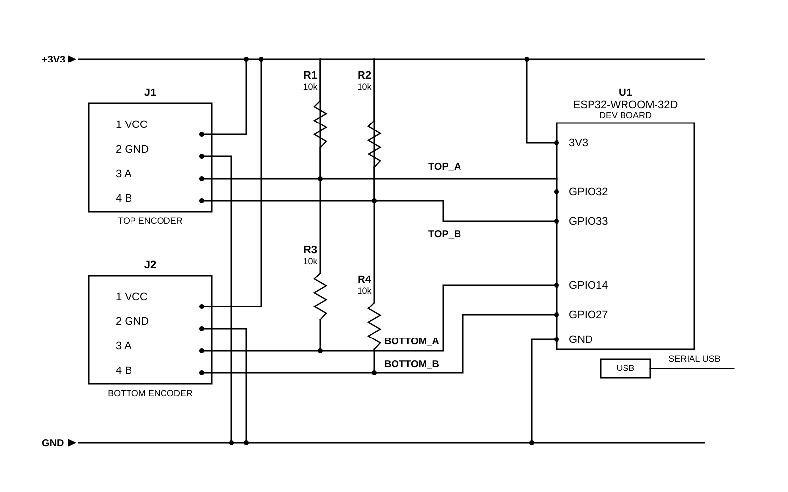

# Eletronica

Esta pasta contém o **diagrama esquemático eletrônico** do projeto.

O circuito foi desenvolvido para medir o fluxo de ar **acima** e **abaixo** de uma asa utilizando **dois encoders incrementais**, conectados a um **ESP32-WROOM-32D**, com leitura dos canais em quadratura e envio dos dados pela serial USB.

## Diagrama esquemático

<p align="center">
  
</p>

## Visão geral do circuito

O sistema eletrônico é composto por:

* **1 ESP32-WROOM-32D**
* **2 encoders incrementais**

  * encoder superior
  * encoder inferior
* **4 resistores pull-up de 10 kΩ**
* **alimentação em 3,3 V**
* **terra comum**
* **conexão USB serial com o computador**

O objetivo do circuito é ler a rotação de dois anemômetros:

* um posicionado **acima da asa**
* um posicionado **abaixo da asa**

Essas rotações são convertidas em valores de **RPM** pelo firmware em MicroPython executado no ESP32.

## Conexões

### Encoder superior (`J1`)

| Pino do encoder | Função      | Conexão no ESP32 |
| --------------- | ----------- | ---------------- |
| VCC             | Alimentação | `+3V3`           |
| GND             | Terra       | `GND`            |
| A               | Canal A     | `GPIO32`         |
| B               | Canal B     | `GPIO33`         |

### Encoder inferior (`J2`)

| Pino do encoder | Função      | Conexão no ESP32 |
| --------------- | ----------- | ---------------- |
| VCC             | Alimentação | `+3V3`           |
| GND             | Terra       | `GND`            |
| A               | Canal A     | `GPIO14`         |
| B               | Canal B     | `GPIO27`         |

## Resistores pull-up

O circuito utiliza **quatro resistores de 10 kΩ**:

* `R1` e `R2` para o encoder superior
* `R3` e `R4` para o encoder inferior

Esses resistores fazem o **pull-up** dos sinais dos canais **A** e **B** para `3,3 V`.

Isso é importante principalmente se as saídas dos encoders forem do tipo:

* **open collector**
* **open drain**

## Alimentação

Todo o sistema lógico deve operar em **3,3 V**.

* o pino `3V3` do ESP32 alimenta os encoders;
* todos os terras devem estar conectados em comum;
* os sinais que chegam ao ESP32 **não devem exceder 3,3 V**.

> **Importante:** não conecte diretamente sinais de `5 V` aos GPIOs do ESP32.

## Saída serial

O ESP32 envia os dados para o computador por meio da **USB serial**.

O formato esperado da saída é:

```text
rpm_bottom,rpm_top
```

Exemplo:

```text
312.45,389.21
```

Onde:

* `rpm_bottom` representa o anemômetro inferior;
* `rpm_top` representa o anemômetro superior.

## Observações importantes

* Todos os **GNDs devem ser comuns**.
* Os encoders devem ser compatíveis com o nível lógico do ESP32.
* Caso o encoder tenha saída aberta, os resistores pull-up são obrigatórios.
* O esquema representa a eletrônica principal do sistema, focada na leitura dos sensores e comunicação com o computador.
