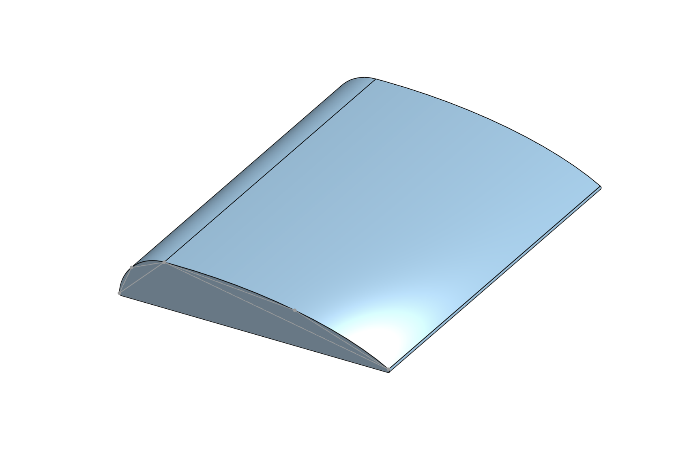
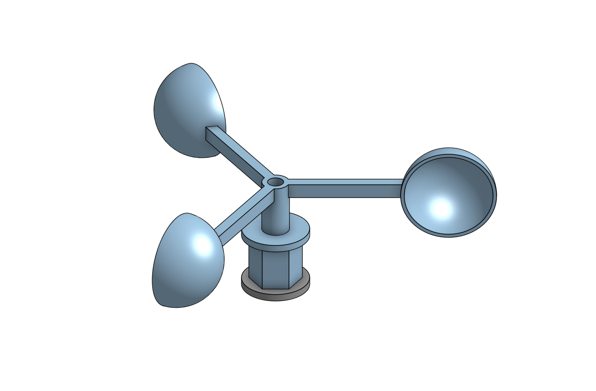
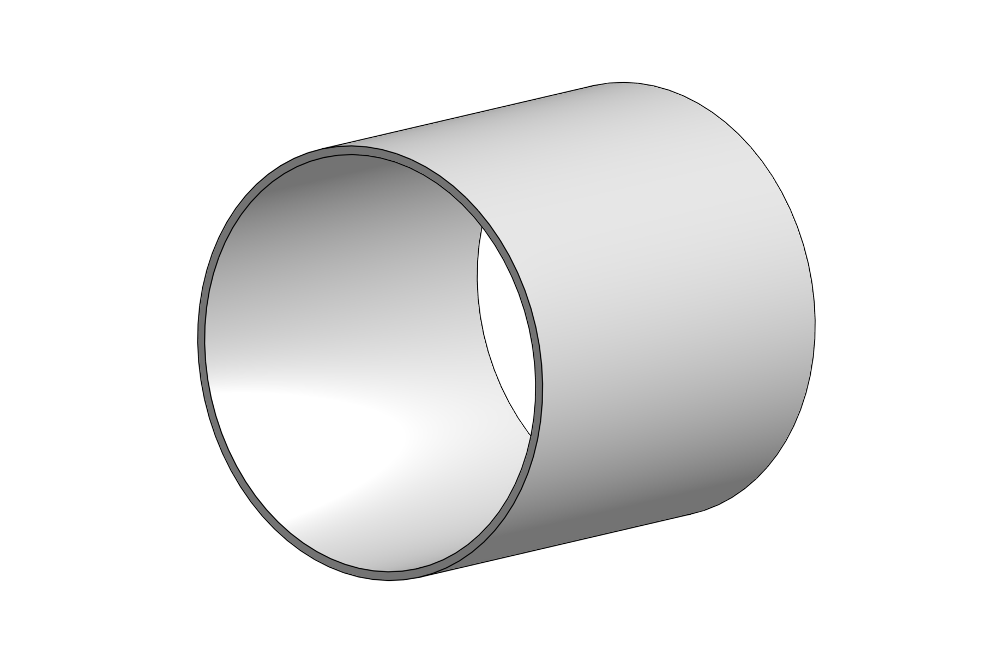

# Hardware

Esta pasta contém os arquivos mecânicos, modelos CAD e instruções de montagem de um projeto escolar de física criado para demonstrar como uma asa gera sustentação.

O conjunto mecânico é formado por três partes principais:

- uma asa experimental;
- dois anemômetros de copos;
- um túnel de vento feito com tubo de PVC.

A pasta `cad/` deve conter os arquivos `.STEP`

A pasta `stl/` deve conter os modelos preparados para impressão 3D.

## Asa experimental

<p align="center">
  
</p>

A asa foi projetada com uma superfície inferior aproximadamente plana e uma superfície superior curva, formando um perfil aerodinâmico.

No experimento, o ar passa ao redor da asa dentro do túnel de vento. Um anemômetro é posicionado acima da asa e outro abaixo dela, permitindo comparar a velocidade média do escoamento nas duas regiões.

### Características

- largura aproximada: `20 cm`;
- área projetada utilizada nos cálculos: `120 cm²`;
- fabricação por impressão 3D;
- perfil superior curvo;
- superfície inferior utilizada como referência de altura.

### Orientação

A borda arredondada deve ficar voltada para a entrada do fluxo de ar. A borda mais fina deve apontar para a saída do túnel.

A asa deve ficar centralizada no túnel e presa de forma que não se mova com o vento.

## Anemômetro

<p align="center">
  
</p>

O anemômetro utiliza três braços distribuídos ao redor de um eixo central. Cada braço possui uma meia esfera oca responsável por captar o fluxo de ar e produzir rotação.

O eixo central é conectado a um encoder incremental through-bore, que mede a quantidade de pulsos e permite calcular a velocidade de rotação em RPM.

### Características

- três copos;
- distribuição angular de aproximadamente `120°`;
- raio aproximado do conjunto: `5 cm`;
- eixo central conectado ao encoder;
- fabricação das peças por impressão 3D.

### Montagem mecânica

1. Imprima o suporte central, os três braços e os três copos.
2. Encaixe ou fixe um copo na extremidade de cada braço.
3. Oriente todos os copos no mesmo sentido de rotação.
4. Fixe os braços ao suporte central com separação uniforme.
5. Instale o conjunto no eixo do encoder.
6. Confirme que o rotor gira livremente e sem tocar no suporte.
7. Verifique se o conjunto está equilibrado antes de realizar medições.

O anemômetro deve girar com o menor atrito possível. Atrito, desalinhamento ou diferença de massa entre os copos podem alterar as medições.

## Túnel de vento em PVC

<p align="center">
  
</p>

O túnel de vento utiliza um tubo de PVC para conduzir o fluxo gerado por um ventilador ao redor da asa.

### Características

- diâmetro aproximado: `24 cm`;
- formato cilíndrico;
- espaço interno para a asa e os dois anemômetros;
- ventilador instalado em uma das extremidades;
- saída de ar livre na extremidade oposta.

O tubo ajuda a direcionar o fluxo e reduzir interferências externas. Entretanto, ele não produz um escoamento perfeitamente uniforme e pode gerar turbulência próxima às paredes.

## Posicionamento dos componentes

Uma organização recomendada dentro do túnel é:

```text
Entrada de ar
     ↓
[ Ventilador ]
     ↓
[ Anemômetro superior ]
[        Asa            ]
[ Anemômetro inferior ]
     ↓
Saída de ar
```

Os dois anemômetros devem ser posicionados em pontos equivalentes da corda da asa:

- um acima da superfície superior;
- outro abaixo da superfície inferior.

Eles não devem tocar na asa nem ficar excessivamente próximos às paredes do tubo.

## Montagem completa

### 1. Preparação das peças

Antes da montagem:

- imprima as peças da asa e dos anemômetros;
- remova suportes e rebarbas;
- teste os encaixes;
- confirme que os rotores giram livremente;
- verifique se a asa cabe dentro do tubo de PVC.

### 2. Instalação da asa

1. Marque o centro do tubo.
2. Posicione a asa com a borda arredondada voltada para o ventilador.
3. Mantenha a asa aproximadamente nivelada.
4. Fixe a asa pelas laterais ou por um suporte inferior.
5. Evite que o suporte bloqueie uma parte significativa do fluxo.

### 3. Instalação dos anemômetros

1. Posicione um anemômetro acima da asa.
2. Posicione o segundo anemômetro abaixo da asa.
3. Mantenha os dois em posições equivalentes ao longo da corda.
4. Garanta espaço suficiente para os rotores girarem.
5. Fixe os encoders para impedir vibrações e deslocamentos.

### 4. Instalação do ventilador

1. Fixe o ventilador na entrada do tubo.
2. Certifique-se de que o fluxo esteja apontando para a asa.
3. Evite grandes aberturas entre o ventilador e o tubo.
4. Mantenha cabos e suportes fora da região principal do escoamento.


### 5. Instalação da eletronica

Conecte os encoders no ESP32 de acordo com o modelo esquematico que esta disponivel em:

- [`../electronics/`](../electronics/)

Os codigos usados para ler os encoders estão disponiveis em:

- [`../firmware/`](../firmware/)

## Recomendações de impressão 3D

Configurações iniciais sugeridas:

- material: PETG ou ABS;
- altura de camada: `0,20 mm`;
- preenchimento: `15%` a `25%`;
- paredes: pelo menos `3`;
- suportes: conforme a orientação da peça;
- tolerância adicional nos encaixes: aproximadamente `0,2 mm`.

Esses valores são apenas referências e podem precisar de ajustes de acordo com a impressora e o material utilizado.

Para os braços do anemômetro, utilize uma quantidade suficiente de paredes para reduzir deformações. Para a asa, evite preenchimento excessivo caso a massa total seja importante para o experimento.

## Limitações mecânicas

O conjunto possui algumas limitações experimentais:

- o fluxo produzido pelo ventilador pode não ser uniforme;
- as paredes do tubo podem alterar o escoamento;
- os anemômetros medem velocidades em pontos fixos;
- o atrito do eixo interfere na rotação;
- diferenças entre as peças impressas podem afetar a calibração;
- vibrações podem causar leituras instáveis;
- o suporte da asa e dos sensores também interfere no fluxo.

Por esse motivo, os resultados representam uma aproximação experimental da velocidade média acima e abaixo da asa.